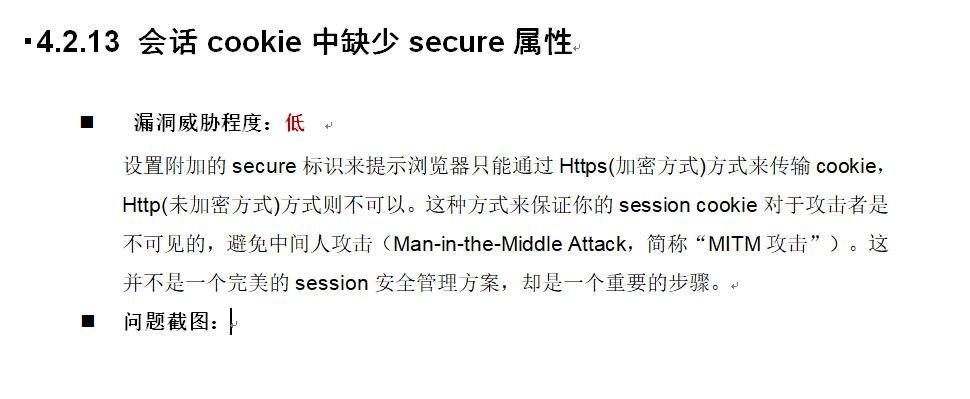
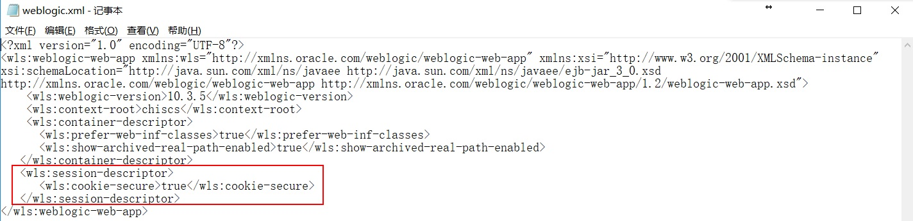

## <center>安全：会话cookie中缺少secure属性</center>

> <https://docs.oracle.com/cd/E21764_01/doc.1111/e14308/securecookies.htm#OMADM4243>
> <https://www.cnblogs.com/forwill/p/6181984.html>
> 
> 第三方安全测试机构给的 《xxx渗透测试报告》中提到网站有此漏洞 
> 

### 解决方法

参考上面的连接，需要在应用 war 包的 weblogic.xml 文件中添加如下内容：
```
<wls:session-descriptor>
        <wls:cookie-secure>true</wls:cookie-secure>
        <wls:cookie-http-only>true</wls:cookie-http-only>
 </wls:session-descriptor>
```

实际配置当中只设置了 `<wls:cookie-http-only>true</wls:cookie-http-only>` 即可有效。




注意：记得重新发布修改后的 war 包。

（完）